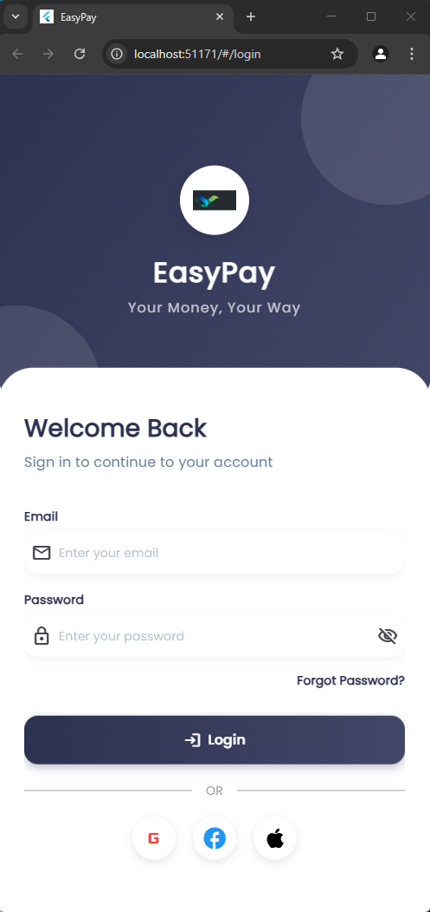
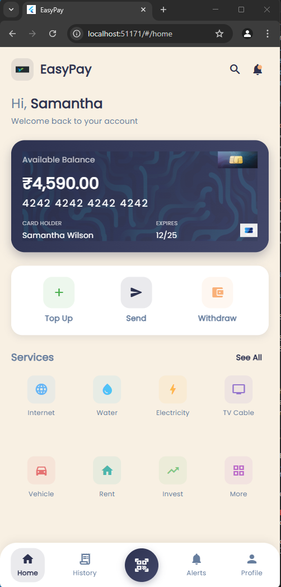
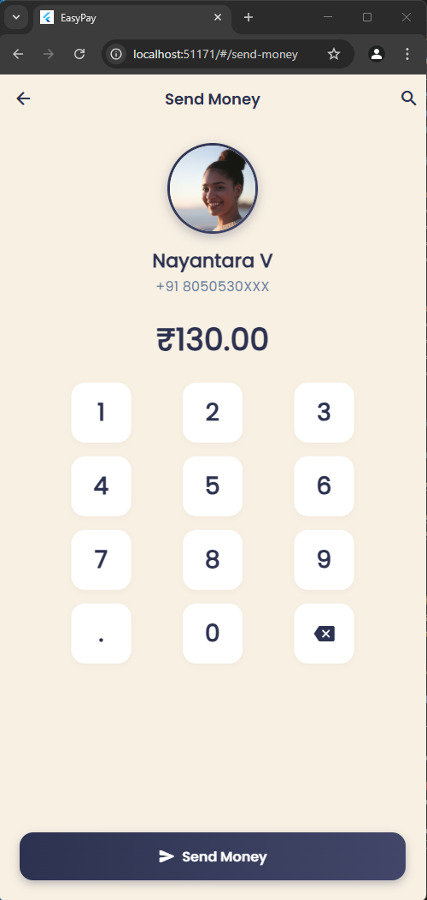
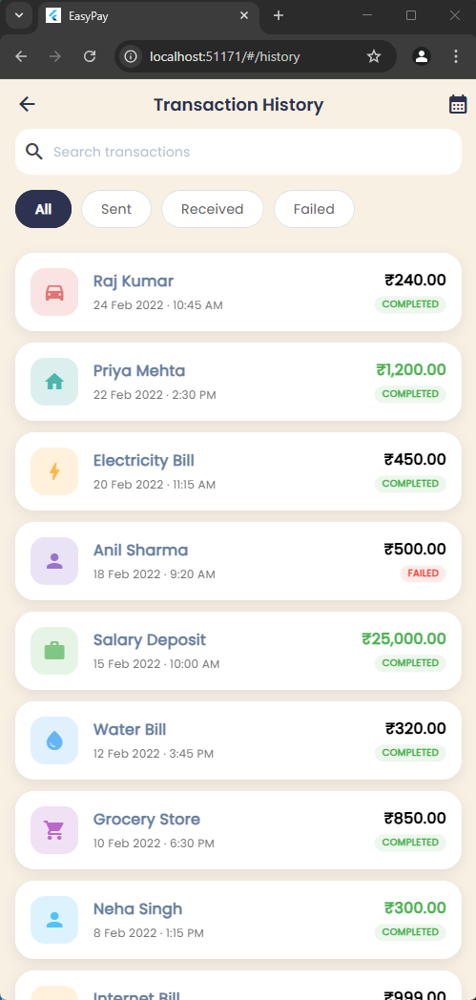
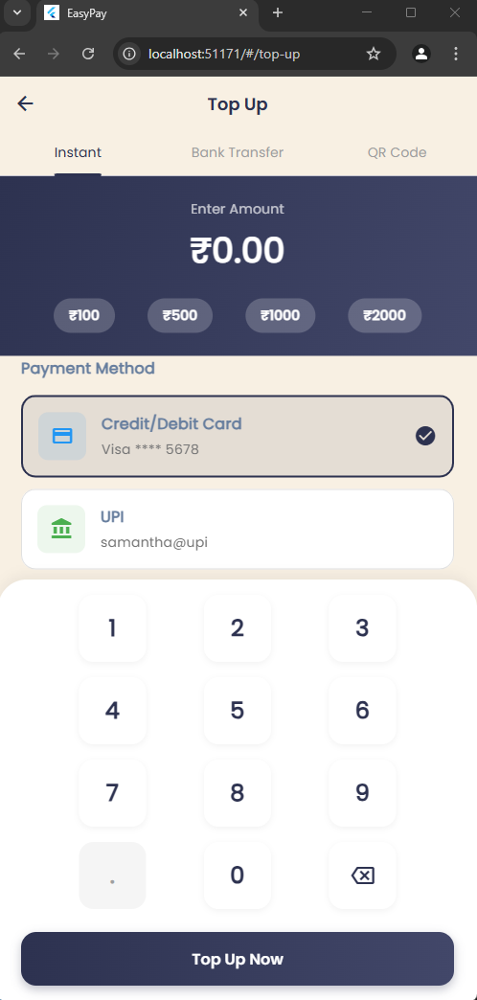
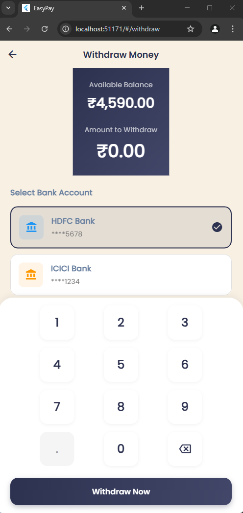
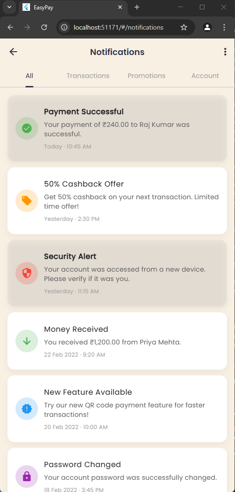
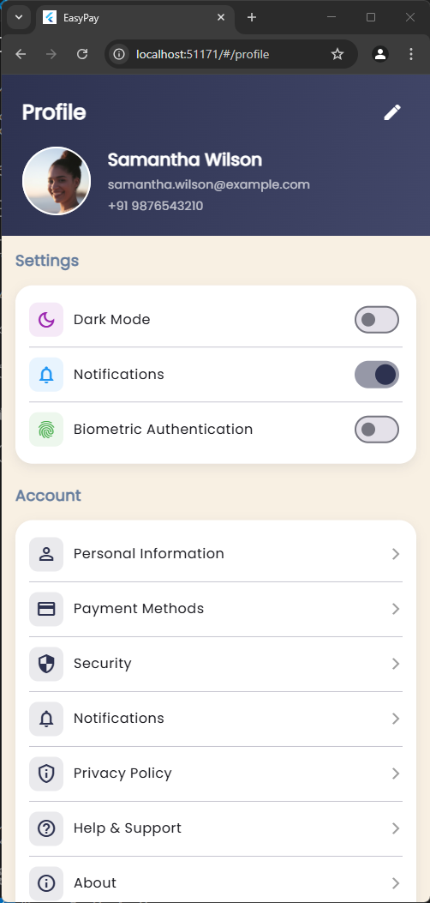

# EasyPay - Mobile Payment App

  

  A modern digital payment application built with Flutter and GetX.

## Overview

EasyPay is a feature-rich mobile payment application designed to provide users with a seamless and secure way to manage their finances. With an intuitive interface and comprehensive functionality, EasyPay allows users to send money, top up their accounts, withdraw funds, view transaction history, and manage their profile all in one place.

## Features

- **User Authentication** - Secure login system
- **Dashboard** - Overview of balance and recent transactions
- **Send Money** - Transfer funds to other users
- **Top Up** - Add funds to your account using various payment methods
- **Withdraw** - Transfer funds to your bank account
- **Transaction History** - Detailed history with filtering options
- **Notifications** - Real-time updates on account activities
- **Profile Management** - User profile and settings

## Screenshots

  
  
  
  

  
  
  
  

## Installation

### Prerequisites

- Flutter SDK (2.10.0 or higher)
- Dart SDK (2.16.0 or higher)
- Android Studio / VS Code
- Android SDK / Xcode (for iOS)

### Steps

1. Clone the repository:
   \`\`\`bash
   git clone https://github.com/yourusername/easypay.git
   \`\`\`

2. Navigate to the project directory:
   \`\`\`bash
   cd easypay
   \`\`\`

3. Install dependencies:
   \`\`\`bash
   flutter pub get
   \`\`\`

4. Run the app:
   \`\`\`bash
   flutter run
   \`\`\`

## Project Structure

\`\`\`
lib/
├── app.dart                  # Main app configuration
├── main.dart                 # Entry point
├── data/                     # Data layer
│   ├── models/               # Data models
│   └── repositories/         # Data providers
├── modules/                  # Feature modules
│   ├── home/                 # Home screen
│   ├── login/                # Authentication
│   ├── send_money/           # Money transfer
│   ├── top_up/               # Account top up
│   ├── withdraw/             # Fund withdrawal
│   ├── history/              # Transaction history
│   ├── notifications/        # Notifications
│   ├── profile/              # User profile
│   └── transfer_receipt/     # Transfer confirmation
├── routes/                   # App navigation
│   ├── app_pages.dart        # Route definitions
│   └── app_routes.dart       # Route names
└── shared/                   # Shared components
    ├── constants/            # App constants
    ├── themes/               # UI themes
    ├── widgets/              # Reusable widgets
    └── services/             # Global services
\`\`\`

## Architecture

EasyPay follows the GetX pattern for state management, dependency injection, and navigation:

- **Controllers**: Handle business logic and state management
- **Views**: UI components that observe controller states
- **Bindings**: Manage dependency injection
- **Routes**: Handle navigation between screens
- **Services**: Provide global functionality
- **Repositories**: Handle data operations

## Technologies Used

- **Flutter**: UI framework
- **GetX**: State management, routing, and dependency injection
- **Dart**: Programming language
- **Google Fonts**: Typography
- **Intl**: Internationalization and formatting

## Future Enhancements

-
